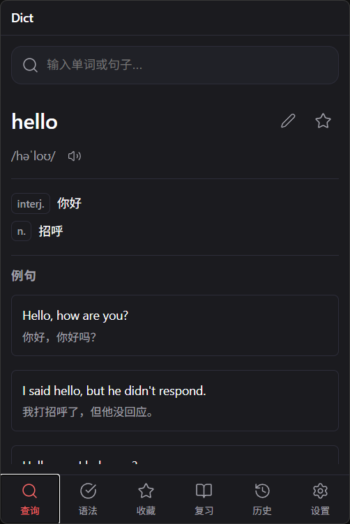
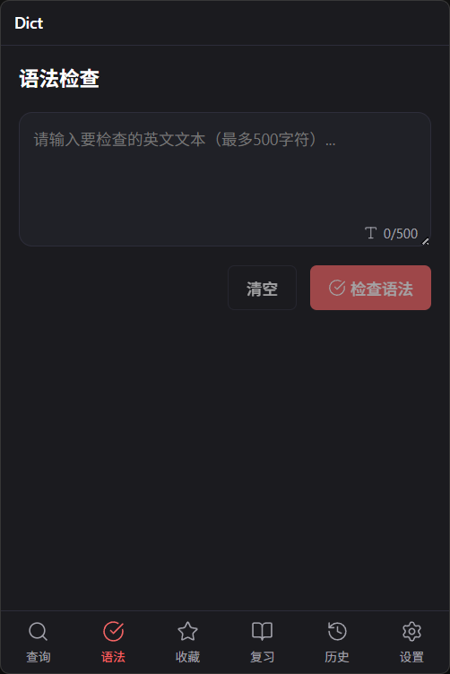
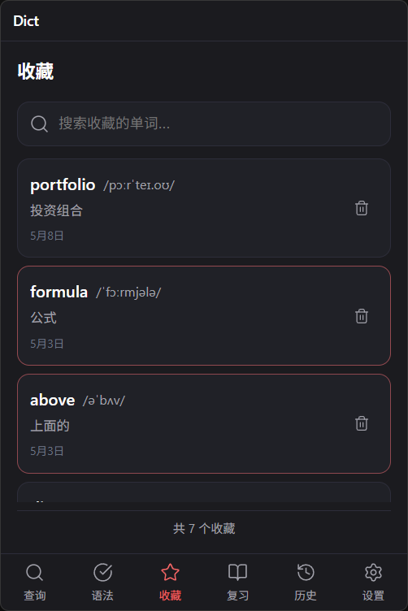
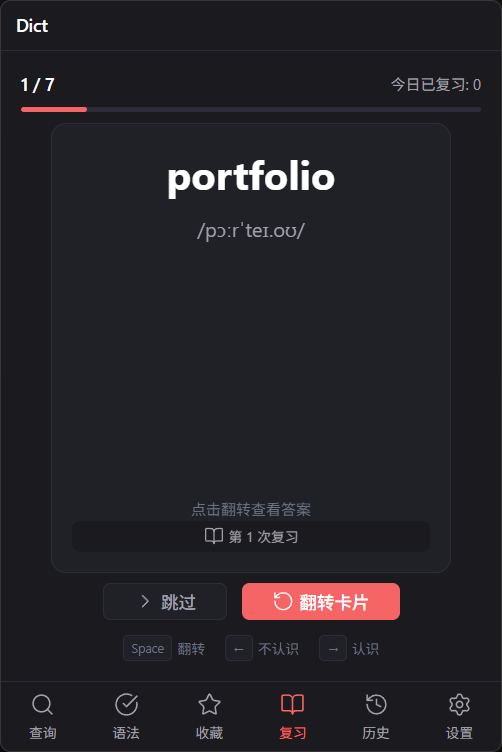
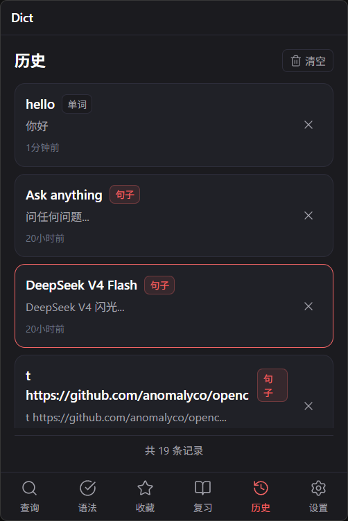
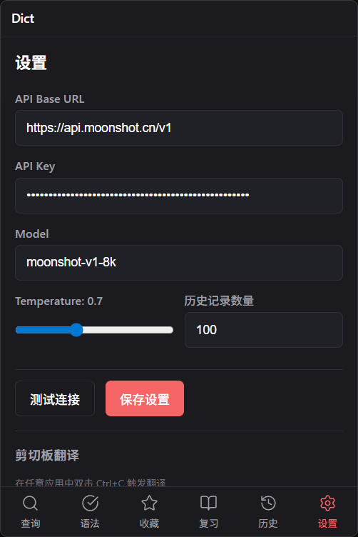

# dict

dict 是一个 AI 词典工具桌面应用。它将用户输入的单词发送给配置好的大模型 API，按固定格式返回内容并渲染展示。

## 核心功能

| 功能 | 描述 |
|------|------|
| 🔍 单词查询 | 查询单词的词性、翻译和例句 |
| ⭐ 收藏单词 | 收藏感兴趣的单词以便后续复习 |
| 📚 复习单词 | 复习已收藏的单词 |
| 📝 查询历史 | 查看之前的查询记录 |
| 🌐 语句翻译 | 支持整句翻译 |
| ⚙️ 自定义配置 | 支持配置大模型 API（OpenAI 通用格式） |
| 📋 自动读取剪切板 | 自动检测剪切板英文内容并翻译 |
| 🖥️ 系统托盘 | 点击托盘图标打开窗口，关闭窗口不退出程序 |
| ✖️ 无窗口按钮 | 移除最小化和关闭按钮，保持界面简洁 |
| 💾 本地缓存 | 使用 IndexedDB (Dexie.js) 存储查询过的单词，重复查询时直接读取本地数据 |
| ✏️ 单词编辑 | 支持编辑单词的解释和例句，自定义内容 |
| 📝 批注备注 | 为单词添加个人批注和备注，方便记忆和复习 |
| 📤📥 导入导出 | 支持收藏单词的导入导出，JSON 格式，方便备份和迁移 |
| 🔊 单词发音 | 点击音标旁的喇叭图标播放单词发音（使用 Google Translate TTS） |

## 预览

|查询|语法|收藏|学习|历史|设置|
|-|-|-|-|-|-|
|| | | | ||

---

## 功能详细说明

### 1. 单词查询

#### 1.1 查询交互

- 搜索框位于窗口顶部
- 支持回车键触发查询
- 查询时显示加载状态（Loading 动画）
- 查询失败显示错误提示，支持重试

#### 1.2 查询结果展示

- **单词标题**：大号字体展示，右侧有收藏按钮（星形图标）
- **音标**：美式音标 /ˈæpəl/（如有）
- **词性与翻译**：按词性分组展示，如 `n.`、`v.`、`adj.`、`adv.` 等
- **例句区域**：最多显示 3 条例句，每条包含英文和中文翻译
- **整句翻译**（可选）：如果是句子，直接返回翻译结果

#### 1.3 返回数据格式

```json
{
  "word": "查询的单词",
  "translation": {
    "n.": ["名词翻译1", "名词翻译2"],
    "v.": ["动词翻译"],
    "adj.": ["形容词翻译"],
    "adv.": ["副词翻译"]
  },
  "example": [
    { "en": "英文例句1", "zh": "对应的中文翻译" },
    { "en": "英文例句2", "zh": "对应的中文翻译" },
    { "en": "英文例句3", "zh": "对应的中文翻译" }
  ],
  "phonetic": "/ˈæpəl/"
}
```

---

### 2. 收藏单词

#### 2.1 收藏操作

- 在查询结果页面，点击星形按钮收藏/取消收藏
- 收藏成功后，星形按钮变为填充状态
- 收藏的单词保存到 IndexedDB（使用 Dexie.js）

#### 2.2 收藏列表

- 独立页面/面板展示所有收藏的单词
- 按收藏时间倒序排列（最新的在前）
- 支持搜索收藏的单词
- 支持取消收藏操作
- 支持点击单词查看详情（回到查询结果页）

#### 2.3 收藏数据结构

```typescript
type FavoriteWord = {
  id: string;           // 唯一标识（UUID 或单词本身）
  word: string;         // 单词
  translation: string;  // 主要翻译（用于列表展示）
  phonetic?: string;    // 音标
  createdAt: number;    // 收藏时间戳
  queryData: QueryResult; // 完整的查询结果
}
```

#### 2.4 导入导出功能

- **导出收藏**：将收藏的单词导出为 JSON 文件，便于备份
  - 导出文件格式：`favorites_YYYY-MM-DD.json`
  - 包含完整的单词数据（单词、音标、翻译、例句等）
  - 导出时自动去重，不会导出重复的单词
  
- **导入收藏**：从 JSON 文件导入收藏的单词
  - 支持选择本地 JSON 文件进行导入
  - 自动跳过已存在的单词（避免重复）
  - 导入成功后显示导入数量和跳过的重复数量
  - 导入时重新生成 ID，避免 ID 冲突

- **导入导出文件格式**

```json
{
  "version": "1.0",
  "exportDate": 1700000000000,
  "favorites": [
    {
      "id": "uuid-string",
      "word": "example",
      "translation": "例子",
      "phonetic": "/ɪɡˈzæmpəl/",
      "createdAt": 1700000000000,
      "queryData": { ... },
      "reviewCount": 0,
      "masteryLevel": 0
    }
  ]
}
```

---

### 3. 复习单词

#### 3.1 复习模式

- 独立的复习页面
- 随机或按顺序展示收藏的单词
- **卡片式交互**：
  - 正面：显示单词本身
  - 背面：显示翻译和例句
  - 点击卡片翻转查看答案

#### 3.2 复习统计

- 记录每个单词的复习次数
- 记录上次复习时间
- 显示今日复习进度（如：已复习 10/50）

#### 3.3 复习操作

- 「认识」按钮：标记为已掌握，减少复习频率
- 「不认识」按钮：标记为需加强，增加复习频率
- 「下一个」按钮：跳过当前单词

---

### 4. 查询历史

#### 4.1 历史记录

- 自动保存每次查询记录
- 存储最近的 100 条记录（可配置）
- 按查询时间倒序排列

#### 4.2 历史列表

- 独立页面/面板展示历史记录
- 每条记录显示：单词、主要翻译、查询时间
- 支持点击历史记录重新查看详情
- 支持清空历史记录
- 支持删除单条记录

#### 4.3 历史数据结构

```typescript
type HistoryItem = {
  id: string;           // 唯一标识
  word: string;         // 查询的单词/句子
  type: 'word' | 'sentence'; // 查询类型
  result: QueryResult;  // 查询结果
  timestamp: number;    // 查询时间戳
}
```

---

### 5. 语句翻译

#### 5.1 翻译模式

- 支持输入整句英文进行翻译
- 返回结果直接展示中文翻译，不包含例句

#### 5.2 自动识别

- 自动识别输入内容是单词还是句子
- 单词：按单词格式返回（含词性、例句）
- 句子：只返回翻译结果

#### 5.3 句子翻译返回格式

```json
{
  "type": "sentence",
  "original": "The quick brown fox jumps over the lazy dog.",
  "translation": "那只敏捷的棕色狐狸跳过了那只懒惰的狗。"
}
```

---

### 6. 自定义配置

#### 6.1 配置项

| 配置项 | 描述 | 默认值 |
|--------|------|--------|
| API Base URL | 大模型 API 基础地址 | <https://api.openai.com/v1> |
| API Key | 大模型 API 密钥 | 空 |
| Model | 模型名称 | gpt-3.5-turbo |
| Temperature | 模型温度参数 | 0.7 |
| 历史记录数量 | 保留历史记录数量 | 100 |

#### 6.2 设置页面

- 独立设置页面
- 表单形式展示所有配置项
- API Key 输入框需密码掩码
- 支持测试连接（Test Connection 按钮）
- 保存后自动生效

#### 6.3 配置存储

- 配置文件位于用户数据目录

---

### 8. 系统托盘

#### 8.1 托盘图标

- 应用启动时在系统托盘显示图标
- 支持 Windows、macOS、Linux 平台
- 图标文件位于 `public/` 目录

#### 8.2 托盘交互

- **左键点击**：显示/隐藏应用窗口
- **右键菜单**：
  - 显示/隐藏窗口
  - 退出应用

#### 8.3 窗口关闭行为

- 点击窗口关闭按钮不退出程序，而是隐藏窗口
- 完全退出需通过托盘右键菜单选择「退出」

---

### 9. 自动读取剪切板

#### 8.1 自动检测

- 应用窗口打开时，自动检测剪切板内容
- 仅当剪切板内容为英文时触发自动查询
- 判断逻辑：内容只包含 ASCII 字符且长度 > 0

#### 8.2 防重复查询

- 如果剪切板内容与上次查询相同，不重复查询
- 上次查询结果保留在界面

---

### 10. 本地缓存与编辑

#### 10.1 IndexedDB 本地缓存

- 使用 IndexedDB 存储所有查询过的单词数据
- 重复查询时优先从本地数据库读取，不访问 API
- 首次查询时从 API 获取并保存到 IndexedDB
- 本地数据包含完整的单词信息：音标、翻译、例句等

#### 10.2 单词编辑

- 在查询结果页面，支持编辑单词的解释和例句
- 可以添加、修改或删除词性翻译
- 可以添加、修改或删除例句
- 编辑后的内容保存到 IndexedDB，覆盖原有数据

#### 10.3 批注与备注

- 为任意单词添加个人批注和备注
- 批注内容支持多行文本
- 在复习模式下显示批注，辅助记忆
- 支持随时修改和删除批注

#### 11.4 数据结构

```typescript
type WordEntry = {
  id: string;              // 单词唯一标识
  word: string;            // 单词
  phonetic?: string;       // 音标
  translation: {           // 翻译（可编辑）
    [pos: string]: string[];
  };
  examples: Array<{        // 例句（可编辑）
    en: string;
    zh: string;
  }>;
  note?: string;           // 个人批注/备注
  createdAt: number;       // 首次查询时间
  updatedAt: number;       // 最后更新时间
  queryCount: number;      // 查询次数
}
```

---

## 界面设计规范

### 窗口规格

- 窗口尺寸：400 × 600（宽度 × 高度）
- 固定大小，不可调整
- 无边框窗口（frameless）
- 支持拖拽移动

### 导航结构

```
┌─────────────────────────────┐
│  🔍  收藏  历史  设置        │  ← 底部/侧边导航栏
├─────────────────────────────┤
│                             │
│      内容区域               │
│                             │
└─────────────────────────────┘
```

### 页面切换

- 首页：单词查询（默认）
- 收藏页：收藏列表
- 历史页：历史记录
- 设置页：配置项

### 视觉风格

设计风格参考 [Lucide Icon](https://lucide.dev)，追求极简、干净、现代的视觉体验：

| 元素 | 规范 |
|------|------|
| **整体风格** | 极简主义，留白充足，内容为王 |
| **图标风格** | 线性图标，1.5px 细线条，24px 默认尺寸，统一使用 Lucide 图标库 |
| **主色调** | 深灰黑 `#1a1a1a`（文字、图标）、红色 `#f56565`（强调） |
| **辅助色** | 中性灰 `#6b7280`（次要文字）、浅灰 `#e5e7eb`（边框、分隔线） |
| **背景色** | 深灰 `#1b1b1f`（主背景）、浅灰 `#202127`（卡片、悬浮背景） |
| **圆角** | 小元素 6px（按钮、输入框）、大元素 12px（卡片、弹窗） |
| **字体** | 系统默认字体栈（-apple-system, BlinkMacSystemFont, 'Segoe UI'） |
| **阴影** | 极淡阴影 `0 1px 2px rgba(0,0,0,0.05)`，仅在需要层次时使用 |
| **间距** | 紧凑但舒适，基础间距 4px，遵循 4px 网格系统 |

**设计原则**：

- **克制**：减少不必要的装饰元素，让内容自然呈现
- **一致**：所有图标、按钮、卡片保持统一的视觉语言
- **清晰**：文字与背景对比度充足，确保可读性
- **柔和**：适度的圆角和过渡动画，营造友好的交互体验

---

## 本地数据存储

### 存储方案

| 数据类型 | 存储方式 | 说明 |
|---------|---------|------|
| 收藏单词 | IndexedDB (Dexie.js) | 浏览器端数据库，支持结构化存储和查询 |
| 查询历史 | localStorage | 用户数据目录，自动管理 |
| 用户配置 | localStorage | 用户数据目录，自动管理 |

### 存储路径

```
用户数据目录/
└── config.json         # 用户配置和查询历史（localStorage 管理）
```

IndexedDB 数据存储在浏览器的内部存储中，不直接暴露为文件。

### 存储实现

- **收藏单词**：使用 IndexedDB + Dexie.js，在渲染进程中直接操作
- **查询历史**：使用 `localStorage`，通过 IPC 在主进程中读写
- **用户配置**：使用 `localStorage`，通过 IPC 在主进程中读写

---

## API 设计

### LLM Prompt 设计

#### 单词查询 Prompt

```
你是一个专业的英语词典。请解释以下单词，并按 JSON 格式返回：

单词：{word}

要求：
1. 提供该单词的音标（美式）
2. 列出所有常见词性及对应的中文翻译
3. 提供 3 个实用的英文例句，每个例句附带中文翻译
4. 只返回 JSON 数据，不要其他解释

返回格式：
{
  "word": "单词",
  "phonetic": "/音标/",
  "translation": {
    "n.": ["名词翻译"],
    "v.": ["动词翻译"]
  },
  "example": [
    {"en": "英文例句", "zh": "中文翻译"}
  ]
}
```

#### 句子翻译 Prompt

```
请将以下英文句子翻译成中文：

句子：{sentence}

要求：
1. 提供准确、通顺的中文翻译
2. 只返回翻译结果，不要其他解释
```

### API 调用

- 使用 fetch 或 axios 发送请求
- 支持流式响应（可选优化）
- 超时设置：30 秒
- 错误处理：网络错误、API 错误、超时错误

---

## 技术架构

### 进程架构

- **主进程**：窗口管理、系统交互、文件 I/O
- **渲染进程**：React UI、用户交互
- **预加载脚本**：安全桥接 IPC 通信

### 技术栈

- tauri 2
- React 18 + TypeScript 5
- Vite 5
- Bun（包管理器）
- localStorage（配置存储）
- zustand 状态管理
- Dexie.js 封装 IndexedDB 存储查询过的单词

---

# Tauri2 Template

一个现代化的 Tauri 2 + React + Vite + Tailwind CSS 应用模板，支持桌面端和移动端。

## 特性

- ⚡ **Tauri 2** - 使用 Rust 构建轻量级桌面应用
- ⚛️ **React 19** - 现代 UI 框架
- 🔥 **Vite** - 极速构建工具
- 🎨 **Tailwind CSS 4** - 原子化 CSS 框架
- 🖥️ **跨平台** - 支持 Windows、macOS、Linux 和移动端
- 📦 **预配置插件** - 对话框、文件系统、通知、全局快捷键等

## 快速开始

### 1. 使用 GitHub Template 创建项目

1. 点击 GitHub 页面上的 **"Use this template"** 按钮
2. 填写你的仓库名称（如 `my-tauri-app`）
3. 选择仓库可见性（公开/私有）
4. 点击 **"Create repository from template"**

### 2. 克隆新项目

```bash
git clone https://github.com/YOUR_USERNAME/YOUR_REPO_NAME.git
cd YOUR_REPO_NAME
```

### 3. 配置项目（关键步骤）

**需要将以下占位符替换为你的实际项目名称：**

| 文件 | 占位符 | 替换为 |
|------|--------|--------|
| `package.json` | `"name": "tauri2template"` | 你的包名（如 `my-tauri-app`） |
| `src-tauri/Cargo.toml` | `name = "tauri2template"` | 你的 Rust crate 名（如 `my_tauri_app`） |
| `src-tauri/Cargo.toml` | `name = "tauri2template_lib"` | 你的 lib 名（如 `my_tauri_app_lib`） |
| `src-tauri/tauri.conf.json` | `"productName": "tauri2template"` | 应用显示名称（如 `"My Tauri App"`） |
| `src-tauri/tauri.conf.json` | `"identifier": "com.example.tauri2template"` | Bundle ID（如 `"com.company.myapp"`） |
| `src-tauri/tauri.conf.json` | `"title": "tauri2template"` | 窗口标题 |
| `src-tauri/src/main.rs` | `tauri2template_lib::run()` | 你的 lib 名（如 `my_tauri_app_lib::run()`） |
| `index.html` | `<title>Tauri2 Template</title>` | 网页标题 |

**推荐做法：** 使用 IDE 的全局查找替换功能（VS Code: `Ctrl+Shift+H`）搜索 `tauri2template` 并替换为你的项目名。

### 4. 安装依赖

使用 [bun](https://bun.sh/)（推荐）：

```bash
bun install
```

### 5. 运行开发服务器

```bash
# 仅前端开发
bun run dev

# 完整 Tauri 开发（推荐）
bun run dev:pc
```

### 6. 构建应用

```bash
# 构建前端
bun run build

# 构建 Tauri 应用
bun run build:pc
```

构建完成后，可在 `src-tauri/target/release/` 找到可执行文件。

## 项目结构

```
.
├── src/                    # 前端源码
│   ├── main.tsx           # React 入口
│   ├── App.tsx            # 主应用组件
│   └── index.css          # 全局样式
├── src-tauri/             # Tauri Rust 后端
│   ├── Cargo.toml         # Rust 配置
│   ├── tauri.conf.json    # Tauri 配置
│   └── src/
│       ├── main.rs        # 程序入口
│       └── lib.rs         # 核心逻辑
├── package.json           # Node 依赖
├── vite.config.ts         # Vite 配置
└── tsconfig.json          # TypeScript 配置
```

## 添加 Tauri 插件

Tauri 提供了丰富的官方插件，可按需添加：

```bash
# 添加插件（以 HTTP 为例）
bun add @tauri-apps/plugin-http
```

然后在 `src-tauri/Cargo.toml` 添加：

```toml
[dependencies]
tauri-plugin-http = "2"
```

在 `src-tauri/src/lib.rs` 初始化插件：

```rust
.plugin(tauri_plugin_http::init())
```

## 常见问题

### Q: 如何修改应用图标？

替换 `src-tauri/icons/` 目录下的图标文件，并更新 `tauri.conf.json` 中的 `icon` 路径。

### Q: 如何启用/禁用托盘图标？

在 `src-tauri/src/lib.rs` 的 `setup` 函数中修改或删除托盘相关代码。

### Q: 如何支持移动端？

本模板已配置移动端支持。运行：

```bash
# 确保已安装移动开发依赖
bun install -g @tauri-apps/cli

# Android 开发
bun run tauri android dev
```

### Q: 如何禁用单例模式？

在 `src-tauri/src/lib.rs` 中删除单例插件相关的代码块。

## 许可证

MIT

## 相关链接

- [Tauri 官方文档](https://tauri.app)
- [React 文档](https://react.dev)
- [Vite 文档](https://vitejs.dev)
- [Tailwind CSS 文档](https://tailwindcss.com)
